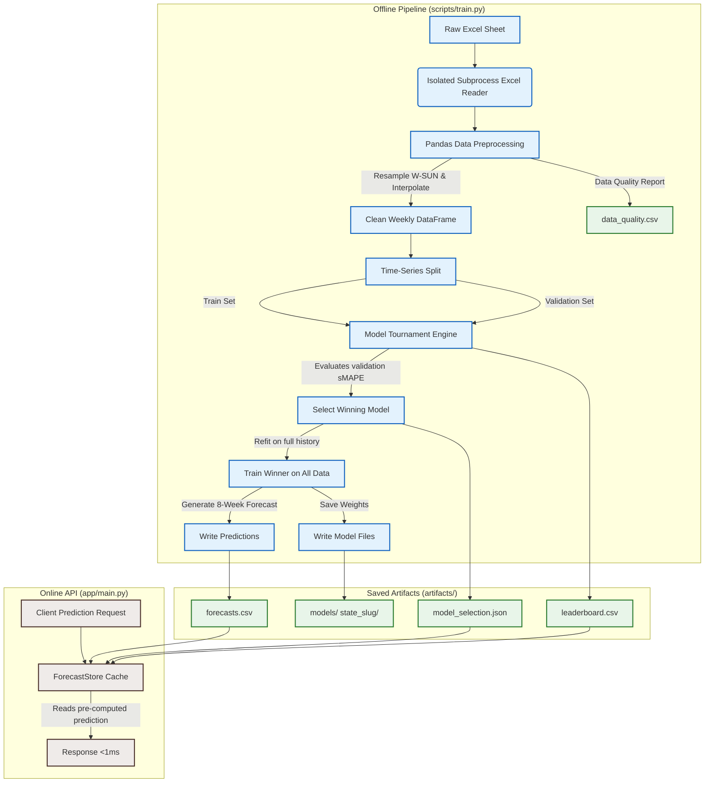

# 🏗️ System Architecture

This document describes the architectural layout of the **State Sales Forecasting Service**. The service is designed to separate **Offline Model Training** from **Online API Prediction Serving**. This design ensures sub-millisecond API response latency, system resilience, and deterministic forecast loading.

---

## 🗺️ High-Level System Overview

---

## 🔄 Offline Training Pipeline

The offline training process is initiated by executing `scripts/train.py`. The pipeline handles the complete dataset lifecycle from ingestion to serialization:

### 1. Raw Excel Isolation
- **Problem**: Reading Excel workbooks directly in Python on Windows systems can result in file-locking issues if the workbook is open in Microsoft Excel.
- **Solution**: The module [`app/forecasting/data.py`](file:///d:/Projects/files/sales-forecasting-service/app/forecasting/data.py) executes Excel parsing in a separate, isolated Python subprocess via `_read_excel_isolated()`. It streams the data back to the parent process using standard output, preventing file-access blockages.

### 2. Data Resampling & Quality Log
- **Aggregation**: Irregular date rows are grouped by `state` and resampled to a strict Sunday-ending weekly frequency (`W-SUN`).
- **Interpolation**: Gaps within a series are filled using **linear interpolation** and bounded using forward/back filling.
- **Auditing**: The preprocessing step exports a data quality report to `artifacts/data_quality.csv` showing exactly how many observations were observed and how many were filled per state.

### 3. Leakage-Controlled Feature Engineering
The supervised learning models (XGBoost and LSTM) require features generated only from history. To ensure zero target leakage during time-series validation and recursive forecasting:
- **Lags**: Features represent lags at $t-1$, $t-7$, and $t-30$.
- **Rolling Windows**: Rolling averages and standard deviations are computed over 4, 8, and 12 weeks of **shifted target values** (`y.shift(1)`).
- **Calendar & Holidays**: Incorporates day, week of year, month, quarter, year, and a binary US federal holiday flag indicating if a federal holiday occurred in the 7-day period ending on that week's date.
- **Future Forecasting**: The function `build_future_feature_row()` recursively updates history step-by-step to predict the next steps without looking ahead.

### 4. Model Selection Tournament
For each state, a tournament evaluates candidate models using a validation split:
- **Split Logic**: The final 8 weeks of the state's series are held out for validation, while all preceding weeks are used for training.
- **Candidate Architectures**:
  - **SARIMA**: Traditional statistical seasonal auto-regressive model.
  - **Prophet**: Additive regression model for trend and seasonality.
  - **XGBoost**: Gradient-boosted decision tree using historical lags and calendar features.
  - **LSTM**: Long Short-Term Memory neural network capturing deep sequence dependencies.
- **Dependency Isolation**: Model wrappers catch dependency installation errors (e.g. if PyTorch/Tensorflow or Prophet wheels fail to import). If a dependency is missing, the model is marked as `dependency_missing` in the leaderboard and the tournament continues.
- **Winning Selection**: The model with the lowest validation **sMAPE** (Symmetric Mean Absolute Percentage Error) is chosen as the winner.
- **Refitting & Persistence**: The winning model is refit on 100% of the state's historical data. The final 8-week predictions are written to `artifacts/forecasts.csv`, the leaderboard metrics to `artifacts/leaderboard.csv`, and model metadata/paths to `artifacts/model_selection.json`.

### 5. Automated Fallback
- If all candidate models fail to train for a state (e.g., due to library import errors, data length errors, or memory constraints), the engine falls back to a **Seasonal Naive** baseline.
- This ensures the pipeline can gracefully write fallback forecasts and continue instead of crashing the batch process.

---

## ⚡ Online Serving Pipeline

The FastAPI server acts as a stateless, read-only layer serving the persisted prediction artifacts:

1.  **On Startup**: The service runs [`app/services/forecast_store.py`](file:///d:/Projects/files/sales-forecasting-service/app/services/forecast_store.py) to read the CSV and JSON artifacts into in-memory pandas DataFrames.
2.  **Stateless API**: Requests for state forecasts are resolved in sub-milliseconds by querying the loaded DataFrames, bypassing any runtime ML calculations.
3.  **Reload Endpoint**: An administrative `POST /reload` request prompts the store to refresh from files, allowing updates to be deployed without restarting the application process.

---

## 📁 Artifacts Manifest

The following artifacts are output to `artifacts/`:

| Artifact File/Folder | Purpose | Format |
| :--- | :--- | :--- |
| `data_quality.csv` | Logs first/last week, total weeks, and interpolated missing counts per state. | CSV |
| `leaderboard.csv` | Contains validation metrics (sMAPE, MAE, RMSE) and statuses for all model candidates. | CSV |
| `model_selection.json` | Stores chosen models, validation errors, and overall training performance metrics. | JSON |
| `forecasts.csv` | Serves the final 8-week forecasts (with timestamps) that are returned by the API. | CSV |
| `models/` | Folder containing serialized objects for refit models (e.g., `.joblib`, `.keras` formats). | Serialized Files |
